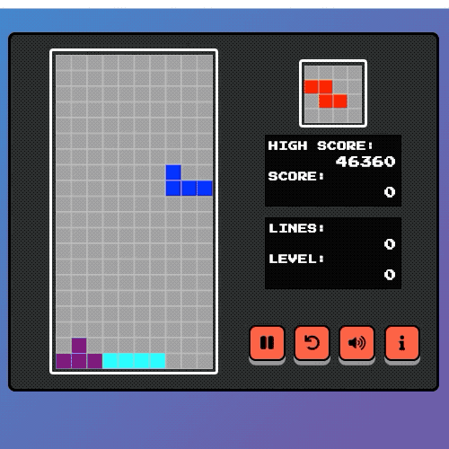
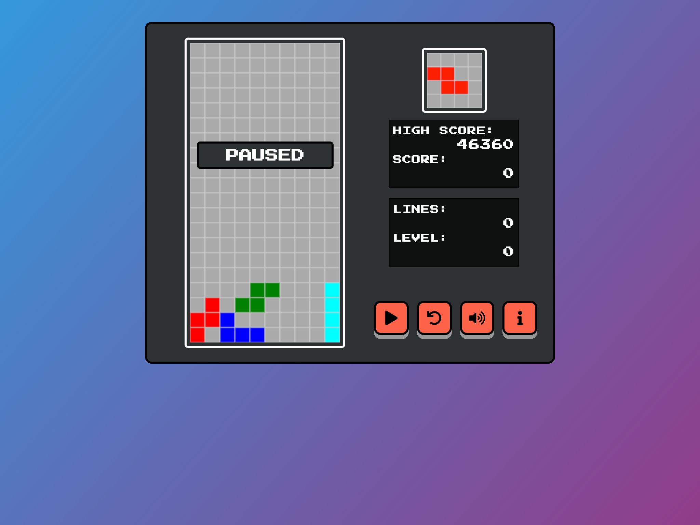
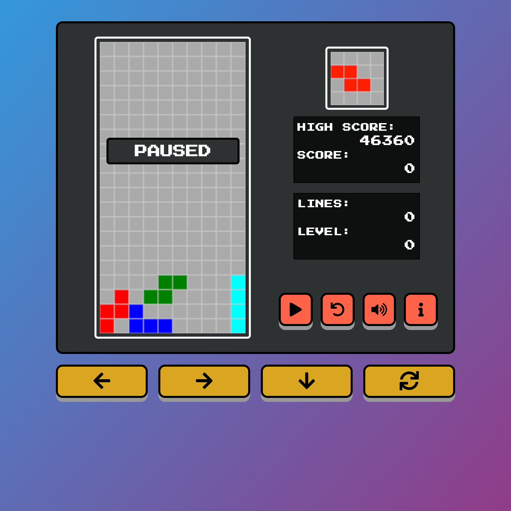
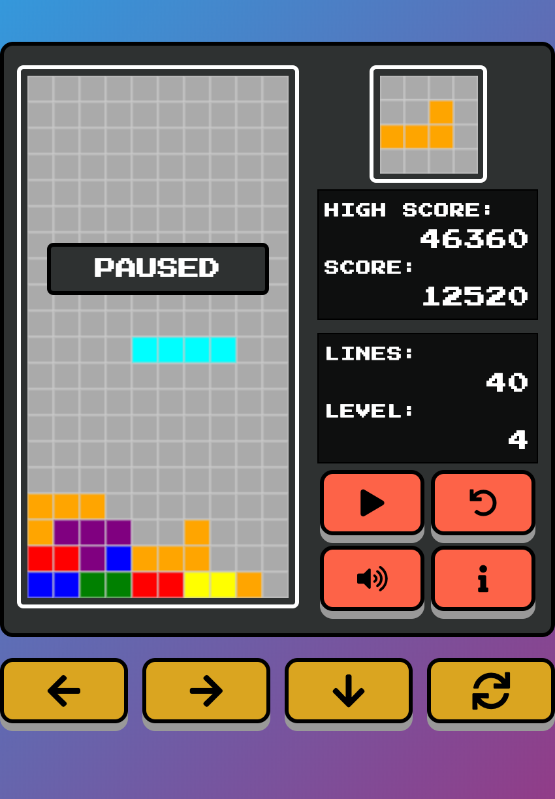

# ga-wdi23-project-1

General Assembly Web Development Immersive - Project 1

# Tetris

## Carlo Bruno | General Assembly Web Development Immersive

### Project \#1 Game - HTML CSS JavaScript

[LIVE DEMO](https://carlo-bruno.github.io/ga-wdi23-project-1/)

## Table of Contents

- [Introduction](#introduction)
- [How to Play](#how-to-play)
- [Building the App](#building-the-app)

## Introduction

>"At it's core, Tetris is all about quick decision-making. You want to make as many decisions, they do not have to be good. You just have to make them and move on."
> — Jonas Neubauer, 7-time Classic Tetris World Champion



A Tetris Clone built using JavaScript, HTML5 and CSS3.

### Project Specification

This is Portfolio Project 1 of General Assembly Web Development Immersive. The goal is to assimilate what we have learned in Unit 1 - Front-end Development into a web game that we can showcase to future employers and fellow developers.

### Technical Requirements

Technical Requirements:

- Display a game in the browser
- Switch turns between two players, or switch turns between a player and the computer (AI) \*
- Design logic for winning & visually display which player won
- Include separate HTML / CSS / JavaScript files
- Stick with KISS (Keep It Simple Stupid) and DRY (Don't Repeat Yourself) principles
- Use Javascript or jQuery for DOM manipulation
- Deploy your game online, where the rest of the world can access it
- Use semantic markup for HTML and CSS (adhere to best practices)

## How to Play

1. Clone this [repo](https://github.com/carlo-bruno/ga-wdi23-project-1) or `git clone https://github.com/carlo-bruno/ga-wdi23-project-1.git`
   OR Click the LIVE DEMO to launch the game in your browser.
2. To move the active piece left and right, use :arrow_left: **Arrow Left** and :arrow_right: **Arrow Right**.
3. To soft drop the piece, use :arrow_down: **Arrow Down**.
4. To rotate the piece clockwise, use :arrow_up: **Arrow Up**.
5. On devices less than 768px, 4 buttons will appear to control the piece. they are marked :arrow_left:, :arrow_right:, :arrow_down:, :arrows_clockwise:. *Note: Mobile gameplay is sub-optimal at the moment.*
6. Buttons on the game panel: Pause/Play Toggle, Restart Game, Music On/Off Toggle, and Info

### Scores and Levels

1. Scores are earned by clearing lines. More lines cleared = more points.
2. Game Level goes up by clearing certain number of lines. And scores are increased accordingly.

- Single = 40 Pts x Level
- Double = 100 Pts x Level
- Triple = 300 Pts x Level
- Tetris = 1200 Pts x Level

3. Every level, the pieces drop a little faster.
4. The game is over when your piece locks at the top of the board.
5. High Scores are stored in your browser's Local Storage.


Desktop implementation


Tablet-size


Mobile

## Building the App

### Big Picture

The key to understanding this particular tetris game is matrices. This implementation uses arrays within arrays to paint and store cells. Let us begin with a **Tetromino**.

```javascript
const Tetro = [ [0, 1, 0],    // a T shaped Tetromino
                [1, 1, 1],    // this shows which cell needs be painted
                [0, 0, 0] ];  // and which ones to leave vacant
```
Now, the **Board** is an array of 20 arrays and 10 _cells_ corresponding to the games **20 Rows** and **10 Columns**. The board will be instantiated with all zero values, and will remain so until we _set or lock_ a piece to the board. (more on this later)

Our tetromino piece will then traverse this board by changing its _position_, its **X** and **Y** coordinates matching the board's columns and rows.

#### The Micro
The function `drawCell(x,y,value)` takes a cell's X, Y, and the value inside that cell, it then matches the value to a _colors_ array for what paint to use on the canvas. And yes, even zeros have to be painted to the board.

`drawMatrix()` takes a matrix, and its starting position and calls `drawCell()` on each cell of every row it's given. It will be called to draw the board and its current state, and the active piece matrix.

#### Game Loop
Because the state of the board is always changing, and we want to move the active piece constantly, we will have to call both our `drawMatrix`... a lot. We implement this inside our game loop, which also holds the automatic drop functionality of our game.

In early versions, I was using setInterval, but eventually switched to requestAnimationFrame. Since then, I have noticed a slight increase in performance, and less intermittent spinning of my laptop's cooling fan. (which, to me, is a sign of a straining cpu)

#### Locking Piece
The idea is to freeze our active piece by copying it's matrix into the board. And to implement that, we have to
1. go through each cell of the matrix
2. get the ones with value (!==0)
3. get the cell's x and y _relative to the board_
4. get the specific cell _in the board_ and set the value from the piece

By the end of this, our board will have non-zero values in it, and our draw functions will render them accordingly.

#### New Kid on the Block
And there's me trying to be clever on my documentation. HAHA.

*'What happens to the piece when it locks? How are you making another piece appear at the top?'* Function `resetPiece()` changes the position of the active piece to the top of the board. It also sets a new matrix from our piece randomizer. The active piece is just being moved and changed the whole game! *"Smokes and mirrors" wink wink*

#### Check Collision
Although quite simple logically, function `collideCheck()` is probably the trickiest to implement in this game. I did not have it fully functioning until day 4 of project week.

The earliest version only checks the bottom row of the matrix and 'looking' one row below it, ideal for locking pieces to the floor, and stacking O-shaped tetrominoes on top of each other. However, it does not check the sides. That is a problem for the next day.

#### Moving Piece
Simple enough, listen for key events, use left arrow key to decrement the column (x--) and right arrow key to increment (x++). I included two conditions for either direction to prevent the tetromino from escaping out of bounds. which works, but only for walls because alas, we still do not have a decent collision checker.

Adding a manual drop, I though was as simple as adding to the y, but I found instead was a nest full of bugs. All because of my unpolished check collision.

#### Check Collision, Revisited
I devised a better collision checker after staring at my code until I fell asleep that night. This function will have to:

1. return a boolean value, this will dictate if our piece can move or not
2. checks for every occupied cell _of our matrix_ 
3. using their x and y position, look at the cells around it _on the board_
4. if the next cell is either a wall or the floor , return `true`
5. if it sees the next cell on the board is occupied, it returns `true`
6. if the path is clear, it will return `false`

To be more specific on which side to check, I added parameters (x,y) to this function. These values will then be added to the x and y position of our occupied cells. Setting `x= -1` or `x = 1` checks the left-hand and right-hand side of the cell, respectively. And `y= 1` to check the cell below.

I used this function inside the move functions. Returning a `collision true` will disallow moving the piece in that direction, and in the case of y-axis, letting us know when and where to lock the piece to the board.

#### Tetris! Clearing Rows
The idea that I had before actually implementing this is to splice the full row, and add an empty one to the top of the board. It worked with single row clears, but clearing multiple rows became problematic. It turns out I was splicing a row and not checking the same row.

```javascript
  // This is the core of the function
  for (let r = 19; r > 0; r--) {
    if (!board[r].includes(0)) {
      board.splice(r, 1);
      board.unshift(new Array(10).fill(0));
      rowsCleared++;
      r++; // the solution is to check the row again before moving forward
    }
  }
```
#### Rotating Piece
The goal here is quite simple: **The column of the old matrix becomes the row of the new matrix**. After a few Google searches and some help from cohort mates, I have a function that, what I thought was rotating my matrix. But further testing shows that it was just flipping the piece in a diagonal axis. (check the medium article linked below)

We found that reversing the new matrix is necessary to actually rotate the piece _counter-clockwise_. And reversing the old matrix before flipping it will rotate it _clockwise_. (note: this created a bug, more on this later)

Rotating the piece works in general. But rotating next to a wall or another piece locks it out of bounds or inside an occupied cell, thus marking another challenge to improve *sigh* check collision.

#### Check Collision, Again?!
The final implementation of the check collision does not _look at the future_, in other words, it checks the cell's current position _after a move_ and if a collision is found, _kicks_ the piece back. This helped with the rotation of the piece, and simplified the implementation on all our move functions.

But we still have a problem, _"What if the rotation does not make sense?"_ While testing, I found that rotating sometimes _teleports_ the piece. And setting a set kick value locks a longer piece outside of the wall.

To solve this, We have to test different _kick_ values, going left and right `+1, -2, +3 , -4...` until theres no more collision. And if the kick is more than the dimension of our matrix (it doesnt make sense), then we set back the previous matrix in its former position.

```javascript
  while (collideCheck()) {
    activePiece.position.x += kick;
    kick = -(kick % 2 == 0 ? kick - 1 : kick + 1);
    if (Math.abs(kick) > m[0].length + 1) {
      // "cant rotate"
      activePiece.matrix = m;       // previous matrix
      activePiece.position.x = pX;  // previous position
      return;
    }
```
#### Adding All Tetrominoes
Now that I have a solid foundation, I deemed it time to implement all the pieces. I simply added an array of matrices, but to differentiate each piece and their paint, their cells contain different values.

```javascript
  [ [0,3,0],    [ [0,4,4],    [ [0,7,0],
    [3,3,3],      [4,4,0],      [0,7,0],
    [0,0,0] ]     [0,0,0] ]     [0,7,7] ]
//  T- piece   // S-piece    // L-piece
```
Having all the pieces now exposed the bug on `rotateMatrix()`. Colors and values are showing properly, but the shapes are completely wrong.

#### Rotate Piece, Revisited
It turns out out `array.prototype.reverse()` is destructive. It was mutating the active piece matrix every time I rotate a piece because I set a reference value instead of using a copy.
```javascript
// to solve this, I sliced the matrix, returning a copy instead of a reference
  let m = activePiece.matrix.slice();
  m.reverse();  // and reversed that
```

After this fix, I have a working tetris game. Additional functions like scores, levels, background music, preview of the next block were added. I tried to follow the Official Tetris Guideline, and most features are modeled from the Nintendo Entertainment System Tetris game released in 1989.

#### Disclaimer, Credits:
The matrix implementation idea is not fully mine. In researching for this game, I have exposed myself to numerous implementation of the game. One in particular used Bitmap, which I find interesting, but too advanced for my level. I also looked at programs not written in Javascript, and tried to parse their codes. I found that most of them  1) use HTML canvas and 2) use matrices. I attached some of the links below to acknowledge their ideas.

### Built with

- [Google Fonts - Press Start 2P](https://fonts.google.com/specimen/Press+Start+2P)
- [FontAwesome Icons](https://fontawesome.com/)
- [Tetris Gameboy Theme](https://commons.wikimedia.org/wiki/File:Tetris_theme.ogg)

### Tutorials, Ideas and Inspiration

- [Tetris - Wikipedia](https://en.wikipedia.org/wiki/Tetris)
- [Tetris Guideline - Fandom Tetris Wiki](https://tetris.fandom.com/wiki/Tetris_Guideline)
- [Tetris Speed and Level - Tetris Wiki](<https://tetris.wiki/Tetris_(NES,_Nintendo)>)
- [Tetris Scoring - Tetris Wiki](https://tetris.wiki/Scoring)
- Write a Tetris Game in JavaScript by Meth Meth Method [Youtube](https://youtu.be/H2aW5V46khA)
- Tetris Game using Javascript by Code Explained [Youtube](https://youtu.be/HEsAr2Yt2do)
- Build Tetris Game with HTML, CSS and Javascript by Coding Dojo [Youtube](https://youtu.be/G7u53KX9i48)
- Tooltip Display Tutorial [jsFiddle](http://jsfiddle.net/AndreaLigios/jtLbpy62/)
- Matrix Rotation [Medium](https://medium.com/front-end-weekly/matrix-rotation-%EF%B8%8F-6550397f16ab)

- The Classic Tetris World Championships Explained [Youtube](https://www.youtube.com/watch?v=9RaqVGzhQTM)
